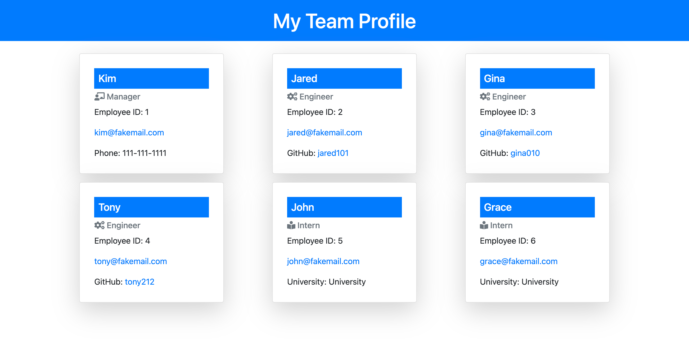

# Team Profile Generator

## Description
This is a command line application that accepts user input and generates a webpage for the user with basic information about their team.

## Screenshot

## Installation
This applications requires Node.js as well as Inquirer and Jest. Please use the commands `npm init` , `npm i inquirer` , and `npm i jest`.
To invoke this program from your command line, enter `node index.js`.

## Usage
Based off user input through an inquirer prompt, a HTML file will be generated in your "dist" directory. Please keep in mind that unless you rename it this file will be replaced each time you generate another. 

## Built With
- JavaScript
- Node.js
- Inquirer
- Jest
- Bootstrap

## Walkthrough / Demo
Click the following if you would like a demo of this application:
https://watch.screencastify.com/v/jmotEEdof5KxgyUNKp7c
